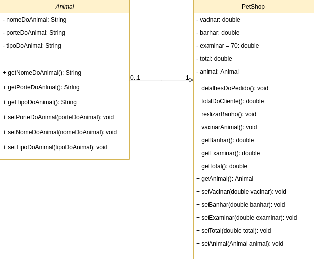

# FIAP Simple Java PetShop project

| ALUNO                       |   RM     |
|-----------------------------|----------|
| Dihogo Cassimiro Teixeira   | 84082    |

### Simple Class UML

| Classe                      | Animal      |
|-----------------------------|-------------|
|  - nomeDoAnimal: String                   |
|  - porteDoAnimal: String                  |
|  - tipoDoAnimal: String                   |
|  + getNomeDoAnimal(): String              |
|  + getPorteDoAnimal(): String             |
|  + getTipoDoAnimal(): String              |
|  + setPorteDoAnimal(porteDoAnimal): void  |  
|  + setNomeDoAnimal(nomeDoAnimal): void    |
|  + setTipoDoAnimal(tipoDoAnimal): void    |

| Classe                      | PetShop     |
|-----------------------------|-------------|
|    - vacinar: double                      |
|    - banhar: double                       |
|    - examinar = 70: double                |
|    - total: double                        |
|    - animal: Animal                       |
|    + detalhesDoPedido(): void             |
|    + totalDoCliente(): double             |
|    + realizarBanho(): void                |
|    + vacinarAnimal(): void                |
|    + getVacinar(): double                 |
|    + setVacinar(double vacinar): void     |
|    + getBanhar(): double                  |
|    + setBanhar(double banhar): void       |
|    + getExaminar(): double                |
|    + setExaminar(double examinar): void   |
|    + getTotal(): double                   |
|    + setTotal(double total): void         |
|    + getAnimal(): Animal                  |
|    + setAnimal(Animal animal): void       |

